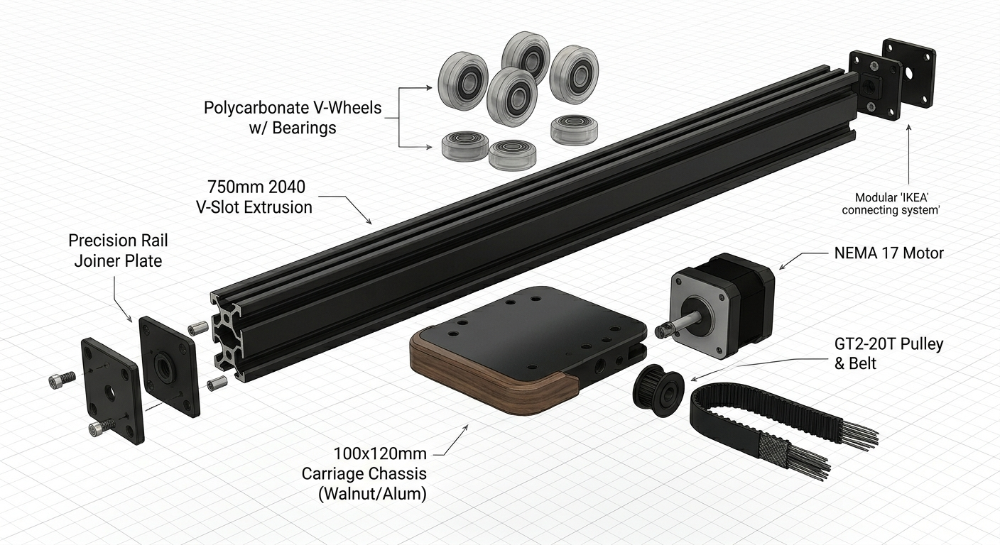
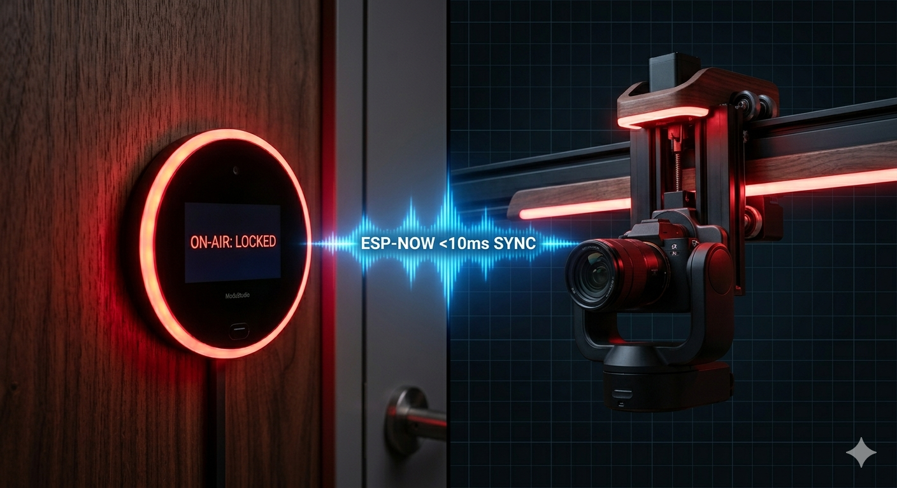

# 🎥 ModuStudio: The IKEA of Studio Automation
**A high-effort, modular hardware ecosystem designed to eliminate 'setup friction' for solo creators.**

## 🚀 The Vision
In shared creative environments, setup friction is the enemy of consistency. ModuStudio automates the physical studio environment—allowing creators to transition from "Idea" to "Action" in under 60 seconds.

---

## 🏗️ Mechanical Specification (Day 1 - 5 Hour Sprint)
Today's deep-dive established the "Skeleton" of the ecosystem, focusing on torsional rigidity and modularity.

### The Arc-Rail Backbone
*   **Chassis:** Dual 750mm **2040 V-Slot Aluminum** extrusion for a total 1.5m span.
*   **Carriage:** 100x120mm Walnut/Aluminum hybrid chassis with a 60mm wheelbase.
*   **Motion:** NEMA 17 Stepper + GT2-20T Pulley system for silent, high-torque travel.
*   **The "IKEA" Factor:** Integrated a Precision Rail Joiner system for modular shipping and assembly.

---

## ⚡ Electronic Architecture & Distributed Logic
ModuStudio uses a **Star Topology** to ensure all modules react simultaneously to the "Record" trigger.

### The Sentry Protocol
*   **Brain:** ESP32-S3 (Master) & ESP32-C3 (Node).
*   **Communication:** **ESP-NOW** (Low-latency Wireless) for <10ms response time.
*   **Action:** When the Rail deploys, the Sentry triggers a 12V Solenoid Bolt and updates its OLED status to **"ON-AIR: LOCKED"**.

---

## 🎨 Design Philosophy: "Concept-to-Casing"
Hardware is approached through an architectural lens, prioritizing spatial integration and premium aesthetics (Matte Black + Dark Walnut).

## 📅 Roadmap
- **March 22:** [Project Launch & Architecture Finalized] (Hour 1-5)
- **April:** Phase 2 - Motion Control & ESP-NOW Handshake (Hour 10-25)
- **July:** Final Prototype / Goal: Shenzhen Fellowship.

---
*Developed for the Hack Club Fallout '26 Program.*
